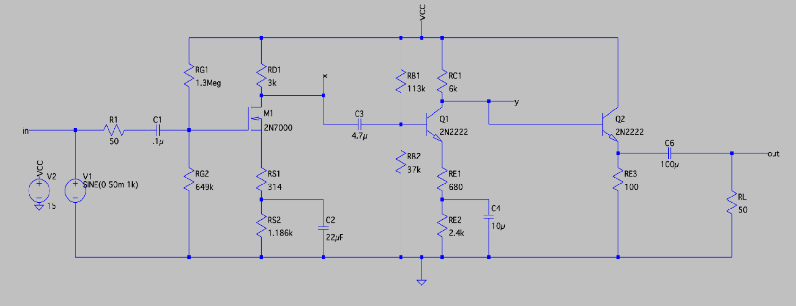
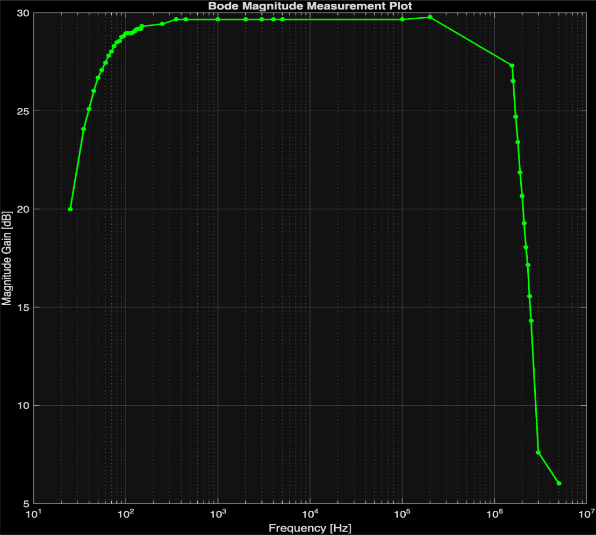

# Three-Stage Discrete Multistage Amplifier

A discrete **CS–CE–EF** amplifier delivering **25 V/V** gain into a 50 Ω load on a **single 15 V supply**, with **>200 kΩ** input resistance and **<25 Ω** output resistance. Designed by hand, verified in LTspice, then built and measured on the bench with hand calculation, simulation, and measurements cross-checked at every step.

## Results at a glance

| Parameter | Spec | Measured | |
|---|---|---|---|
| Midband gain | 25 V/V ±5% | 26–28 V/V at demo* | ✅ |
| Input resistance | > 200 kΩ | ~428 kΩ | ✅ |
| Output resistance | < 25 Ω | 16.5 Ω | ✅ |
| Max symmetrical swing | > 4 Vpp | 4.72 Vpp | ✅ |
| Lower −3 dB | < 200 Hz | 48.4 Hz | ✅ |
| Upper −3 dB | > 5 kHz | 1.56 MHz | ✅ |
| Supply | single 15 V | 15 V | ✅ |

*The gain drifted to ~30 V/V after extended operation — root-caused and documented under [Bench observations](#bench-observations-what-the-datasheet-doesnt-tell-you).

## Architecture

The circuit splits three competing requirements of high input resistance, 25 V/V gain, and a low-impedance drive into 50 Ω across three stages, so no single transistor has to do everything at once. It was **designed from the load backward**, since each stage is loaded by the one that follows and the 50 Ω load is fixed.

| Stage | Device / config | Job | Gain |
|---|---|---|---|
| 1 | 2N7000 common-source | High Rin (a BJT input can't hit >200 kΩ here) + initial gain | ~7.4 V/V |
| 2 | 2N2222A common-emitter | Bulk of the voltage gain | ~3.6 V/V |
| 3 | 2N2222A emitter-follower | Buffer: ~unity gain, low Rout to drive 50 Ω | ~1 V/V |



## Design decisions worth calling out

**Split degeneration resistors.** Each gain stage uses a bypassed + unbypassed resistor pair (RS1/RS2, RE1/RE2). The bypassed resistor sets the DC bias point; the unbypassed one sets AC gain. This lets gain be tuned without disturbing the operating point, the unbypassed values were adjusted in simulation to land the gain instead of re-biasing the whole stage.

**Designing the sim gain high on purpose.** RC1 is upper-bounded by the output-resistance spec (RC1/(β+1) < 25 Ω). Rather than sit at that limit, it was set to 6 kΩ to push the *simulated* gain to ~28 dB, anticipating that real breadboard components measure lower than their models. Building in margin toward the spec instead of centering on it.

**Output-stage power budget.** The emitter follower runs ~85 mA through RE3, dissipating **~715 mW** which is far past a ¼ W resistor's rating, so RE3 was implemented as a **100 Ω 5 W power resistor**. Q2 itself dissipates ~553 mW, close to the 2N2222A's 625 mW limit, which is what capped how hard the output stage could be pushed.

**One dominant low-frequency pole.** The coupling/bypass capacitors were sized so the source-bypass cap C2 sets the dominant pole (~48 Hz) and everything else sits sub-dominant, giving a clean, predictable low-frequency roll-off.

## How it was measured

- **Input resistance** — series-resistor method: a 427.9 kΩ resistor was placed in series at the input and the source-side vs. amplifier-side voltages were used to back out Rin = Rₖ·V₂/(V₁−V₂).
- **Output resistance** — two-load Thévenin method: measured Vout unloaded (5.00 V) and into 50 Ω (3.76 V), giving Rout = RL·(V_nl/V_l − 1) = 16.5 Ω.
- **Max swing** — input raised until the output clipped; 4.72 Vpp undistorted, clipping onset just beyond.
- **Frequency response** — swept and plotted as a Bode magnitude plot in MATLAB.



## Bench observations

- **Thermal gain drift.** Gain measured 26–28 V/V at demonstration but crept to ~30 V/V after roughly an hour of continuous operation. Root cause: VBE falls with temperature, shifting the bias point and raising gain. This nudged the midband slightly outside the ±5% window during the later Bode run which was documented rather than hidden.
- **Calc vs. sim vs. bench.** First-order hand analysis overpredicted stage-2 gain (~33 V/V) because it ignores the Early effect and device non-idealities; simulation and measurement agreed much more closely at ~25–30 V/V. A good reminder of where the small-signal model stops being enough.
- **High-frequency peaking (unresolved).** Gain rose above 200 kHz, peaking near ~1.2 MHz before dipping back to midband. Suspected interaction between the output coupling capacitor, the load, and the output-stage emitter, this was flagged for follow-up rather than looked over.

## Bill of materials

**Stage 1 (CS, 2N7000):** RG1 1.3 MΩ · RG2 649 kΩ · RD1 3 kΩ · RS1 314 Ω · RS2 1.186 kΩ · C1 0.1 µF · C2 22 µF · C3 4.7 µF
**Stage 2 (CE, 2N2222A):** RB1 113 kΩ · RB2 37 kΩ · RC1 6 kΩ · RE1 680 Ω · RE2 2.4 kΩ · C4 10 µF
**Stage 3 (EF, 2N2222A):** RE3 100 Ω **5 W** · C5 100 µF · RL 50 Ω

## Repository structure

```
├── docs/          # Final LTSpice Schematic, Measured Bode plot on MATLAB
└── README.md
```

## Tools

Hand analysis · LTspice · MATLAB · bench (oscilloscope, function generator, Multimeter)

---
